# aldpro-astra-lab

A real **ALD Pro 3.0.0** domain — directory service, Kerberos KDC, integrated DNS and
the web management portal — deployed on **Astra Linux Special Edition 1.7.7**, with a
client machine joined to the domain, domain users, groups, sudo and HBAC rules all
provisioned and *proven working*, not just installed.

This is the production counterpart to [`freeipa-lab`](https://github.com/youngnlit-s5/freeipa-lab):
that repo is the open-source twin built on FreeIPA; this one is the actual commercial
product — same underlying FreeIPA/389-ds/MIT-Kerberos core, RusBITech-Astra's own
management portal, packaging and Astra-specific security-level (Parsec MAC) integration
on top. Everything here maps directly onto the domain migrations I run day to day.

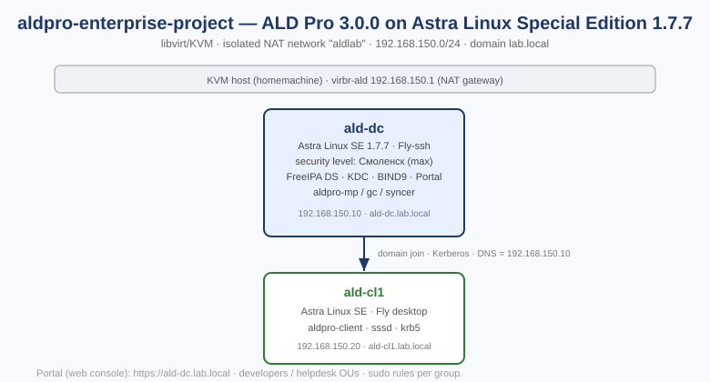

## What it builds

| Layer | Component |
|---|---|
| **OS** | Astra Linux Special Edition 1.7.7, security level "Смоленск" (max, Parsec MAC) on the DC |
| **Directory** | FreeIPA 389-ds, wrapped by ALD Pro's `aldpro-mp` |
| **Authentication** | MIT Kerberos KDC, single sign-on via sssd on the client |
| **DNS** | Integrated BIND9 (bind9-pkcs11) for the `lab.local` zone |
| **Management** | ALD Pro web portal ("Портал управления"), `https://ald-dc.lab.local` |
| **Access control** | Groups, sudo rules, HBAC rules (FreeIPA `sudorule`/`hbacrule` under the hood) |

## ALD Pro ↔ Microsoft AD mapping

| ALD Pro (this lab) | Microsoft AD equivalent | Notes |
|---|---|---|
| `aldpro-server-install` | `dcpromo` / Install-ADDSForest | promotes a plain OS to a domain controller |
| Портал управления (web portal) | ADUC / ADAC / DNS Manager | one web UI instead of several MMC snap-ins |
| FreeIPA DS (389-ds) | NTDS.dit | LDAP directory back-end |
| MIT KDC | AD KDC | same Kerberos protocol, cross-realm trust is possible |
| BIND9 (bind9-pkcs11), AD-integrated zone | AD-integrated DNS | DC doubles as the zone's DNS server |
| Groups / sudo rules / HBAC rules | Groups / GPO / Restricted Groups | ALD Pro sudo+HBAC rules replace GPO-based privilege GPOs |
| `aldpro-client-installer` / `astra-freeipa-client` | `Add-Computer -DomainName` | client enrollment |
| `aldpro-gpupdate --pm/--gp` | `gpupdate /force` | policy refresh on the client |
| `aldpro-syncer` + `aldpro-syncer-pwdsync` | AD Connect / ADMT | hybrid sync and password sync with a real MS AD forest |
| Global Catalog (`aldpro-gc`) | Global Catalog | cross-domain object lookup for trusted MS AD forests |

The `aldpro-syncer` row is not cosmetic: ALD Pro is built to run *next to* an existing
MS AD forest during a migration, syncing users/groups/passwords both ways so nothing
breaks mid-cutover — this is the same mechanism behind the 200-workstation AD-to-ALD
Pro migration I ran, just exercised here end to end on a disposable pair of VMs instead
of production hardware.

## Layout

```
aldpro-astra-lab/
├── preseed/                    # Astra unattended-install answer files (not the ALD
│                                # Pro distro itself -- see Getting the software below).
│                                # Passwords are redacted to CHANGE_ME_* placeholders.
│   ├── preseed-dc.cfg
│   └── preseed-cl1.cfg
├── net/
│   └── aldlab-net.xml          # libvirt NAT network, 192.168.150.0/24
└── docs/
    ├── topology.svg
    ├── RUN.md                  # full walkthrough with the real, working commands
    ├── logs/                   # captured output: id, klist, sudo -l, auth.log denial, aldproctl status
    └── screenshots/            # real screenshots -- portal (login/dashboard/users/groups/
                                 # computers/sudo/HBAC) + real terminal sessions (id+klist,
                                 # sudo working, login denied)
```

## Getting the software

ALD Pro is RusBITech-Astra's commercial product. It is **not** bundled in this repo.
The install pulls the base OS from the official Astra Linux ISO and the ALD Pro
packages from RusBITech-Astra's own apt repositories:

```
deb http://dl.astralinux.ru/astra/frozen/1.7_x86-64/1.7.7/repository-main 1.7_x86-64 main non-free contrib
deb http://dl.astralinux.ru/astra/frozen/1.7_x86-64/1.7.7/repository-update 1.7_x86-64 main contrib non-free
deb https://dl.astralinux.ru/aldpro/frozen/01/3.0.0/ 1.7_x86-64 main base
```

Get the Astra Linux ISO and the ALD Pro administrator documentation from
[astralinux.ru](https://astralinux.ru) / [rubitech.ru](https://www.rubitech.ru); this
lab was built strictly against *Руководство администратора ALD Pro 3.0.0*.

## Quick start

See [`docs/RUN.md`](docs/RUN.md) for the full walkthrough (VM provisioning, preseed
automation, domain controller promotion, client join, and the exact commands used to
prove access control actually works).

## Proof, not just claims

| Check | Evidence |
|---|---|
| Domain controller up (LDAP/KDC/DNS/portal) | [`docs/logs/aldproctl-status.txt`](docs/logs/aldproctl-status.txt) |
| Client joined, domain identity resolves | `id i.sredoevich` → real domain UID/GID |
| Kerberos SSO works | `klist` shows a real `krbtgt`+`ldap` ticket |
| Sudo rule fires for an allowed user | `sudo -l` → `(root) ALL` |
| Disallowed user is denied, not just un-sudo'd | SSH connection is closed at the PAM/HBAC layer before a shell exists, [`auth.log`](docs/logs/login-deny-authlog.txt) |

All screenshots below are real captures off the running VMs — the portal ones via
headless Chromium driven over the DevTools protocol (real browser, real TLS handshake,
real login), the terminal ones off an actual SSH session into `ald-cl1`. None of it is
staged. (The portal UI is Russian-only in this ALD Pro 3.0.0 build — see the
["can the portal run in English?"](#can-the-portal-run-in-english) note below.)

### Web portal

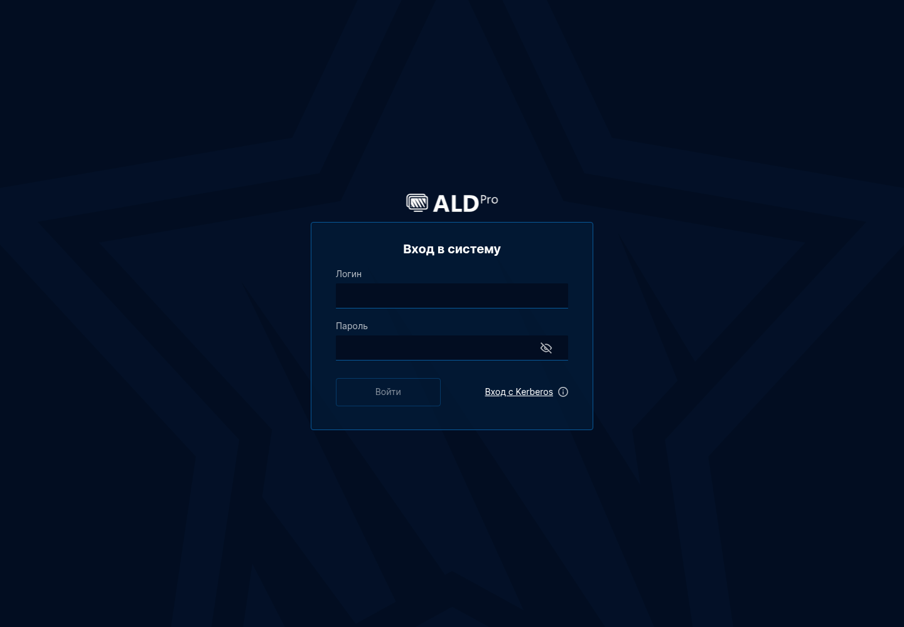
*Login page — `https://ald-dc.lab.local`, username/password or Kerberos SSO.*

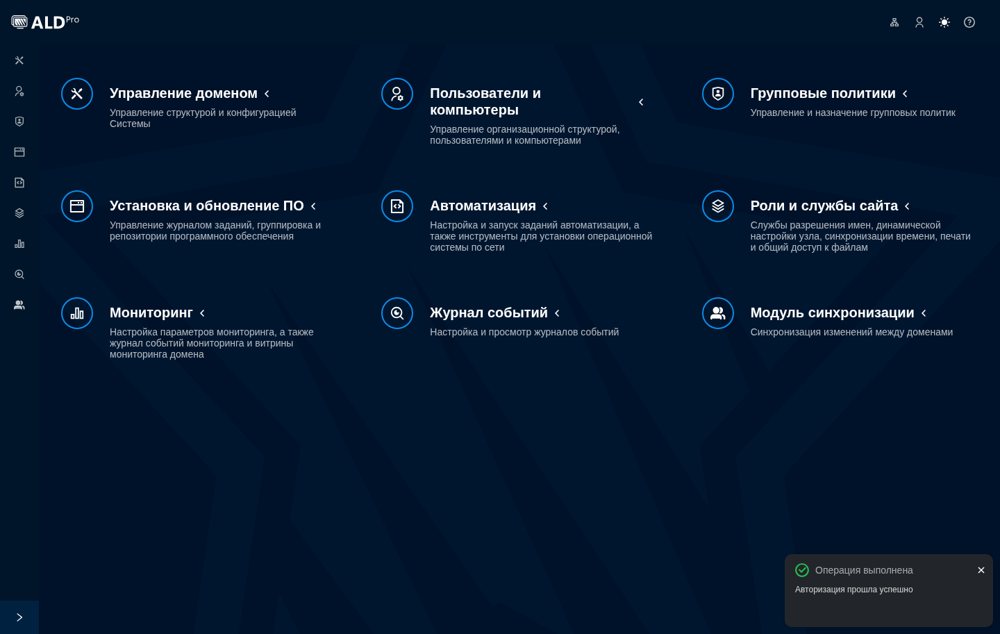
*Main dashboard right after a successful login ("Авторизация прошла успешно").*

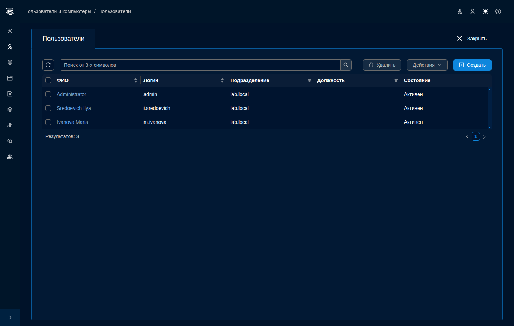
*Users — `admin`, `i.sredoevich` (developers), `m.ivanova` (helpdesk), all Active.*

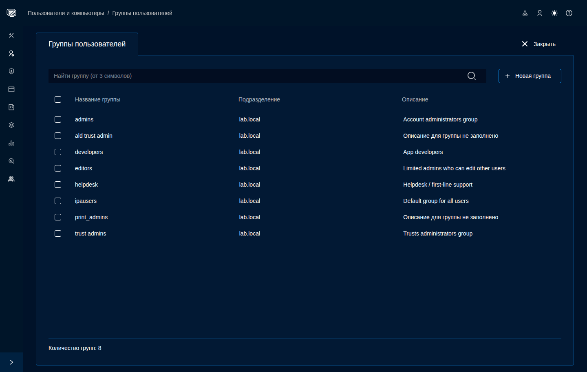
*Groups — `developers` and `helpdesk` alongside the built-in FreeIPA/ALD Pro groups.*

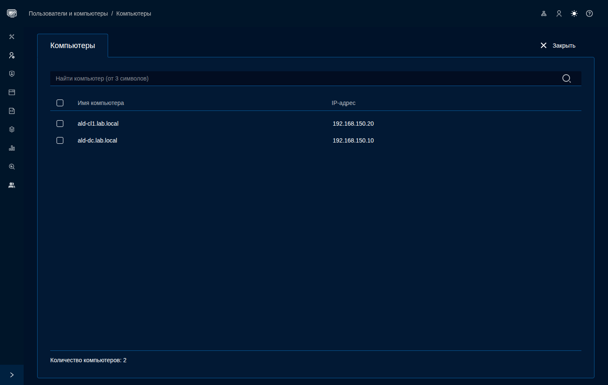
*Computers — both `ald-dc` and `ald-cl1` registered with their real lab IPs, proof the
client join actually reached the directory.*

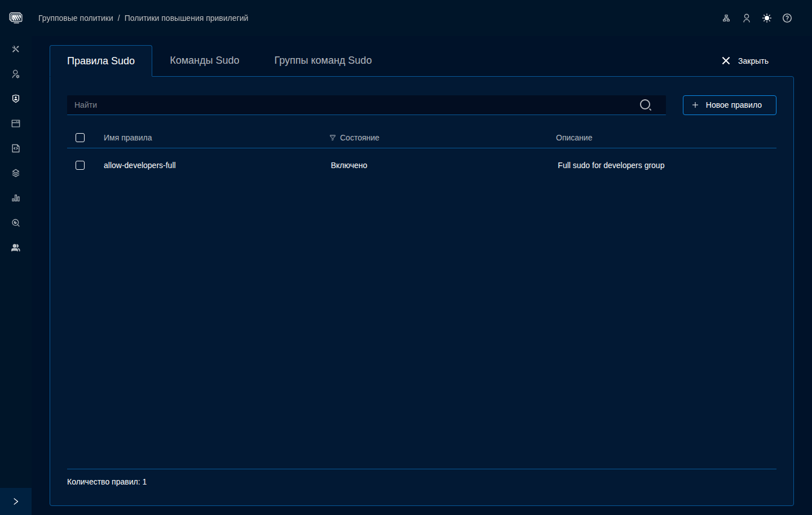
*Sudo rule `allow-developers-full`, enabled.*

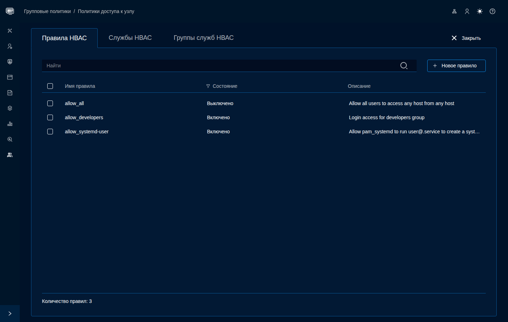
*HBAC access rules — the `allow_all` default is disabled so `allow_developers` actually
governs who gets in.*

### Terminal — proof it works end to end

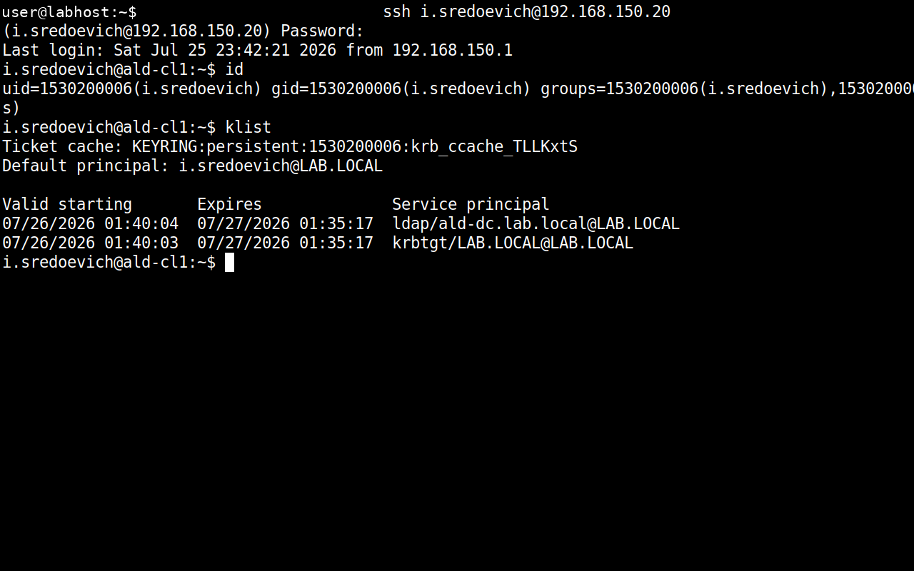
*Real SSH login as `i.sredoevich`: forced password change on first login (FreeIPA
default), `id` resolving domain UID/GID/group via sssd, `klist` showing a real
Kerberos ticket obtained transparently at login.*

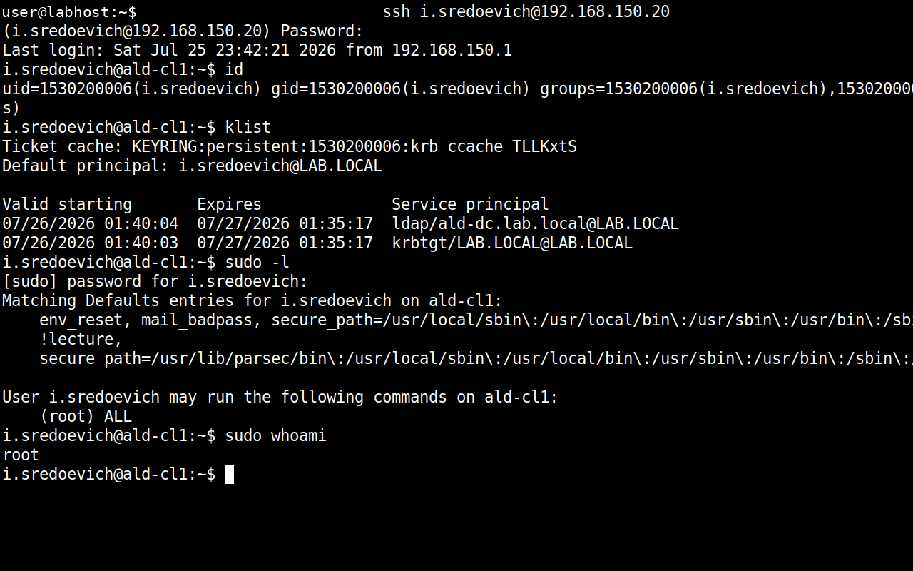
*`sudo -l` shows the actual rule from the portal (`(root) ALL`), `sudo whoami` returns
`root`.*

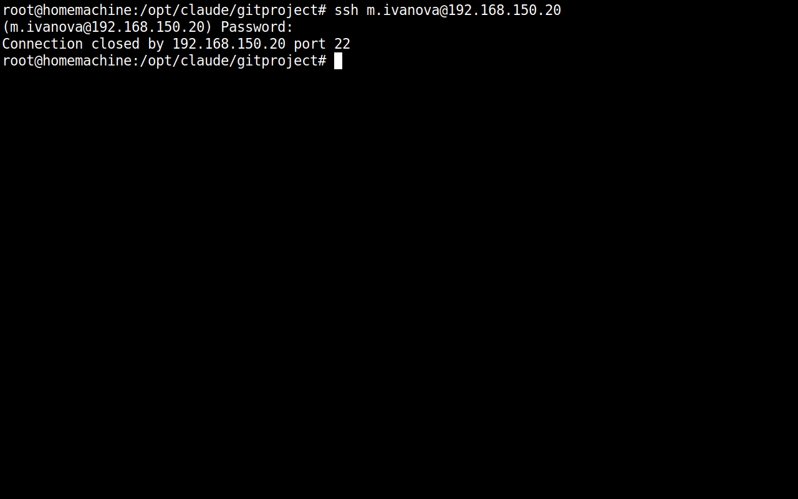
*`m.ivanova` (helpdesk, not covered by the HBAC rule) enters the correct password and
the connection is simply closed — denied at the PAM/account phase, before a shell ever
exists.*

### Can the portal run in English?

Short answer: not in this build, at least not through anything user-facing. English
translation files genuinely exist on disk for every module
(`/opt/rbta/aldpro/mp/ui/app/*/locales/en/*.json`), and the frontend uses `i18next`
with the standard `localStorage.i18nextLng` key — but on every real page load the app
resets that key back to `"ru"` regardless of what's stored beforehand, a `?lng=en`
query string, or the browser's own `navigator.language` (which was already `en-US` in
the headless Chromium used for these screenshots). There's no language item in the
header icons either — the four icons are a DC picker, "your user" (opens your own
profile card), light/dark theme, and help. Nothing in the user's LDAP record
(`ipa user-show admin --all`) carries a locale attribute either. So the English
strings are bundled in the product but the switch isn't wired up anywhere I could
find — the portal is effectively Russian-only in practice.

## Why this matters

Standing up a directory is easy to claim and hard to fake. This repo shows the whole
loop on the real product: two VMs installed unattended from a stock Astra ISO, a
domain controller promoted by the book, a client joined and *proven* — login as an
allowed user, denial of a disallowed one, `klist` showing a real Kerberos ticket, a
sudo rule actually firing — with the command output and screenshots to back it up, plus
an honest log of what broke along the way and how it got fixed (below).

---

# Журнал развёртывания

Подробные заметки о том, как этот стенд разворачивался на реальных VM: preseed
несколько раз ломался на диалогах, которых нет в стандартном Debian preseed, сама
утилита `aldpro-server-install` падала пять раз подряд на разных шагах из-за
внутренней гонки, а графический `aldpro-client-installer` оказался неработоспособен
без реального экрана. Ничего из этого не было видно при простом чтении документации —
только при реальном запуске.

## 1. Preseed-автоустановка Astra Linux SE 1.7.7 — восемь багов подряд

Инсталлятор Astra — классический debian-installer (isolinux + `install.amd/{vmlinuz,
initrd.gz}`, пункт меню `Automated install` с `auto=true priority=critical`). Пример
preseed из документации ALD Pro (Часть 2, «Roles and site services → Automation → Boot
profiles → Preseed») рабочий как база, но рассчитан на PXE-сценарий с полностью сетевым
debootstrap. У нас — статический IP без DHCP на момент первой загрузки, плюс
подключённый ISO. Вот все восемь багов, каждый следующий обнаруживался только после
фикса предыдущего:

1. **`astra-license/license`** — лицензионное соглашение Astra Linux. Ключа в обычном
   Debian preseed нет — Astra-специфичный, нашёл разбором .udeb-пакета (`ar x
   astra-license_*.udeb`, файл `debian/templates`).
2. **`cdrom-detect/load_media`** — "No common CD-ROM drive was detected". Возникло
   потому, что `--location` в virt-install указывал на смонтированную директорию, а не
   на файл .iso — в этом случае virt-install не подключает ISO как виртуальный CD.
   Фикс: `--location <path>.iso` вместо смонтированной директории.
3. **Диалог выбора языка** — всплывает раньше, чем скачивается сетевой preseed.cfg
   (сеть на этот момент ещё не поднята). Фикс — `locale=en_US.UTF-8` прямо в kernel
   cmdline (`--extra-args`), а не в preseed-файле.
4. **`debootstrap` по сети падает с exit 1** через `repository-base`. Переключился на
   официально документированный офлайн-путь: раз ISO уже физически подключен, базовая
   система ставится прямо с CD (`apt-setup/cdrom/set-first boolean true`), а сетевые
   репозитории ALD Pro подключаются уже после загрузки ОС через SSH.
5. **`apt-setup/cdrom/set-double`** (default `true`, не был задан явно) — после
   успешного debootstrap с CD инсталлятор переспрашивает "Scan another CD or DVD?" и
   зависает. Ключ нашёл разбором `apt-cdrom-setup_*.udeb`.
6. **GRUB-пароль** — забытый в первой версии preseed `grub-installer/password`.
7. **`late_command` не может использовать `wget`** — в базовой системе, установленной
   только с CD (без сетевого debootstrap), `wget` не входит в набор пакетов по
   умолчанию. Установщик показывал общую ошибку "Failed to run preseeded command" без
   объяснения причины. Фикс — переписать все postinstall-шаги (SSH-доступ, `/etc/hosts`,
   отключение NetworkManager) через `in-target bash -c '...'` без внешних зависимостей.
8. **Разовый глюк чтения виртуального CD** ("Debootstrap warning: ... was corrupt").
   Проверка md5sum файла на самом ISO подтвердила, что файл не повреждён (совпадает с
   `md5sum.txt` на диске) — это транзиентный сбой эмуляции IDE CD-ROM в QEMU, не
   проблема дистрибутива. Serial-консоль была настроена только на запись в файл (без
   интерактивного pty), поэтому нажать "Continue" было нечем — просто повторил
   установку с нуля, глюк не воспроизвёлся.

Отдельно: `late_command` пытался вызвать `in-target hostnamectl set-hostname
ald-dc.lab.local` — команда падала, потому что `in-target` это просто chroot, а
`hostnamectl` обращается к `systemd-hostnamed` через D-Bus, которого в chroot нет.
Фикс — писать `/etc/hostname` напрямую (`printf ... > /etc/hostname`).

Диагностика "молча работает" vs "реально зависло" на текстовом serial-выводе
инсталлятора (ANSI/VT100 escape-последовательности в файле лога) — рабочий способ
восстановить текущий экран:

```bash
tmux new-session -d -s astra -x 80 -y 24 "cat ald-dc-console.log; sleep 3600"
tmux capture-pane -t astra -p
```

## 2. Гонка внутри `aldpro-server-install` — систематическая проблема продукта

После чистой установки ОС, поднятия уровня защищённости до "Смоленск" и подключения
репозиториев команда `aldpro-server-install -d lab.local -n ald-dc --ip
192.168.150.10 --setup_gc --setup_syncer --no-reboot` **падала пять раз подряд**,
каждый раз на другом шаге, с одной и той же ошибкой:

```
Exception: Произошла ошибка. Превышено максимальное количество попыток.
Пожалуйста, попробуйте выполнить команду повторно.
```

Разброс: `saltutil.sync_all`, `grains.set is_first_dc`, зависание на `grains.delkey
is_first_dc` (35+ минут на 100% CPU — реальный hang, вручную та же команда занимает
1-2 секунды), `state.apply utils.dc_passwords`. При этом **каждый** упавший шаг,
повторённый вручную сразу после сбоя, отрабатывал за секунды без единой ошибки. Вывод:
дело не в конкретном шаге, а в том, что `aldpro-server-install` дёргает
`aldpro-salt-call` подряд без паузы, и standalone salt-minion не всегда успевает
освободить локальную блокировку между вызовами. Собственный обработчик ошибок скрипта
тоже может зависнуть — при попытке залогировать сбой в LDAP через `send_log_to_ldap`
он стучится в SSSD/D-Bus, которого на этом этапе установки ещё физически нет.

Шестая попытка закончилась настоящим **segfault** интерпретатора Python 3.7 сразу в
нескольких celery-воркерах (`dmesg`: `segfault at ... in python3.7`) — не OOM
(свободной памяти хватало), а нехватка ядер под параллельной нагрузкой на 2 vCPU.
**Увеличение до 4 vCPU сняло проблему полностью** — седьмая попытка отработала от
начала до конца без единого сбоя (~10 минут: FreeIPA/Kerberos/DNS, портал ALD Pro,
Global Catalog).

Побочная находка: `aldproctl status` падал с `IndexError`, потому что
`socket.gethostname()` (сырой `hostname`, не `hostname -f`) возвращал только короткое
имя. Preseed через `netcfg/get_hostname` + `netcfg/get_domain` пишет в `/etc/hostname`
только короткое имя — а документация ALD Pro (2.1.1.3) прямо требует `hostnamectl
set-hostname <FQDN>`. Фикс — писать полное имя в `/etc/hostname` напрямую.

**Рабочая тактика, которая в итоге всё спасла:** снять offline-снапшот диска сразу
после установки ОС + подключения репозиториев + установки пакетов ALD Pro (до
`aldpro-server-install`), и просто откатываться на него при сбое вместо ручной чистки
состояния на лету:

```bash
virsh snapshot-create-as ald-dc pre-server-install --disk-only --atomic
# при сбое — откат и повтор:
virsh destroy ald-dc
rm /var/lib/libvirt/images/ald-dc.pre-server-install
qemu-img create -f qcow2 -b ald-dc.qcow2 -F qcow2 ald-dc.pre-server-install
virsh start ald-dc
```

## 3. Графический `aldpro-client-installer` не работает без настоящего экрана

Документация приводит его как "способ через командную строку", но бинарник — это
PyQt5/PyInstaller-приложение, которому *всегда* нужна Qt-платформа:

- Без `DISPLAY` и без `--gui` падает: `qt.qpa.plugin: Could not load the Qt platform
  plugin "xcb"`.
- С `QT_QPA_PLATFORM=offscreen` — не падает, но виснет насмерть: единственный открытый
  файловый дескриптор процесса — `eventfd` (Qt-эвентлуп), ни одного сетевого
  соединения к контроллеру домена так и не открывается.
- С реальным `Xvfb` — на экране просто пустая форма: поля "Наименование домена",
  "Учётная запись", "Пароль" не заполняются флагами `--domain/--account/--password`
  вообще. Значения командной строки в этой сборке 3.0.0 в GUI-режим не пробрасываются.

Решение — обойти GUI-обёртку и использовать нижележащий CLI напрямую,
`astra-freeipa-client` (тот же инструмент, которым документация описывает вывод
компьютера из домена через `-U`):

```bash
sudo astra-freeipa-client -d lab.local -u admin -p 'ПАРОЛЬ' -y
```

Отработал с первого раза: получил CA-сертификат, зарегистрировал SSH-ключи хоста,
настроил SSSD/Kerberos/PAM — `The ipa-client-install command was successful`.

## 4. Баг `ipa hbactest` в ALD Pro 3.0.0 на обычных локальных пользователях

После создания HBAC-правила и отключения дефолтного `allow_all` (иначе правило ни на
что не влияет) команда `ipa hbactest --user=i.sredoevich --host=... --service=sshd`
вернула `ipa: ERROR: an internal error has occurred`. В `/var/log/apache2/error.log`
нашёлся traceback:

```
File ".../ipaserver/plugins/hbactest.py", line 394, in execute
    is_valid_sid = ipaserver.dcerpc.is_sid_valid(options['user'])
File ".../ipaserver/dcerpc.py", line 89, in is_sid_valid
    security.dom_sid(sid)
ValueError: Unable to parse string: 'i.sredoevich'
```

`hbactest` в этой сборке безусловно пытается распарсить пользователя как Windows SID
(код для доверенных доменов MS AD) и падает вместо того, чтобы сначала проверить,
похожа ли строка на SID вообще. Обходной путь — не полагаться на symulation-тест, а
доказывать allow/deny реальными попытками входа (что и так требовалось).

## 5. HBAC разрешает вход, но не `sudo` — это два разных сервиса

После настройки sudo-правила `sudo -l` для разрешённого пользователя падал с `sudo:
PAM account management error: Permission denied` — не отказ по самому sudo-правилу, а
блокировка HBAC на уровне PAM: правило `allow_developers` разрешало сервисы
`sshd`/`login`, но не `sudo`. У SSSD HBAC гейтит *каждый* PAM-сервис отдельно,
включая `sudo`. Фикс:

```bash
ipa hbacrule-add-service allow_developers --hbacsvcs=sudo
ipa hbacrule-add-service allow_developers --hbacsvcs=sudo-i
```

После этого `sudo -l` показал реальное правило (`(root) ALL`), а `sudo whoami` вернул
`root`.

## Итог

Полный список того, что в итоге доказано вживую, — в разделе
[«Proof, not just claims»](#proof-not-just-claims) выше. Каждая строчка там — это
реальная команда, выполненная на реальной паре VM, а не текст из документации.
